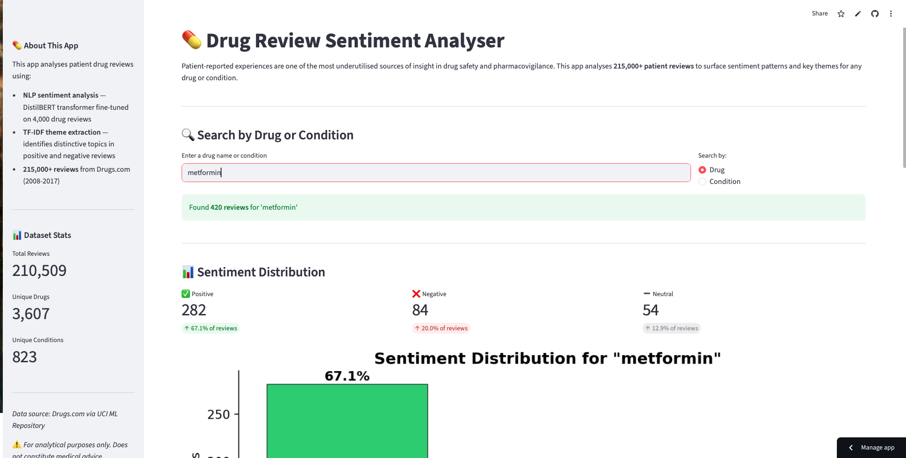

# 💊 Drug Review Sentiment Analyser

[](YOUR_STREAMLIT_URL_HERE)

## Overview

Adverse drug reactions account for a significant proportion of 
hospital admissions globally, yet patient-reported experiences 
remain one of the most underutilised sources of insight in drug 
safety and pharmacovigilance. Understanding what patients say 
about their medications — in their own words — can reveal 
patterns around adverse effects, treatment satisfaction, and 
unmet needs that clinical trials often miss.

This project applies Natural Language Processing to 215,000+ 
patient drug reviews to build an interactive tool that surfaces 
sentiment patterns and key themes for any drug or condition.

---

## 🔴 Live App

👉 [Drug Review Sentiment Analyser](https://drug-review-sentiment-analyser-nejqxxxx2phgedznappfnr7.streamlit.app)

Search by drug name or condition to explore:
- Sentiment distribution across positive, negative and neutral reviews
- Key themes patients praise and complain about
- Most helpful patient reviews surfaced by peer usefulness rating

---

## 📸 App Screenshot



---

## 🗂️ Project Structure


---

## 🔬 Methodology

### Data
- **Source:** Drugs.com patient reviews via UCI ML Repository (Kaggle)
- **Size:** 215,063 reviews across 3,607 drugs and 823 conditions
- **Period:** February 2008 to December 2017

### Phase 1 — Exploratory Data Analysis
Comprehensive EDA revealed key dataset characteristics:
- Rating distribution is heavily skewed positive (U-shaped) 
  with significant class imbalance
- 7 of the top 10 most reviewed drugs are contraceptives 
  (18% of dataset)
- Depression is the second most represented condition
- Review text contains HTML encoding, dosage references 
  and informal language requiring cleaning

### Phase 2 — Data Cleaning and Preprocessing
- Decoded HTML entities using Python's html library
- Removed reviews under 5 words (1% of dataset) based on 
  data-driven threshold analysis
- Created three-class sentiment labels from numeric ratings:
  - Positive: ratings 7-10 (66.1%)
  - Negative: ratings 1-4 (25.0%)
  - Neutral: ratings 5-6 (8.9%)

### Phase 3 — Sentiment Modelling
Applied DistilBERT pre-trained transformer model with 
domain-specific fine-tuning:

| Metric | Baseline | Fine-Tuned | Improvement |
|---|---|---|---|
| Overall Accuracy | 72.3% | 84.5% | +12.2% |
| Positive Recall | 48% | 85% | +37% |
| Negative Recall | 96% | 84% | -12% |
| Positive F1 | 0.64 | 0.85 | +0.21 |

Fine-tuning on 4,000 domain-specific drug reviews 
significantly improved positive class recall from 48% to 
85% — addressing the core weakness identified in baseline 
evaluation where the model consistently misclassified 
analytically-written positive reviews as negative.

### Phase 4 — Topic Extraction
TF-IDF theme extraction applied separately to positive, 
negative and neutral review subsets revealing:
- **Positive reviews:** life improvement language — 
  "life", "recommend", "normal", "lost" (weight loss)
- **Negative reviews:** strong emotional language — 
  "horrible", "worst" — and discontinuation signals — 
  "stopped", "stop"
- **Condition-specific themes:** contraceptive side effect 
  profiles, antidepressant brand comparisons, opioid 
  therapy in pain management

---

## 📊 Key Findings

- **Contraceptive dominance:** 7 of the top 10 most reviewed 
  drugs are contraceptives, reflecting strong patient engagement 
  around hormonal side effects
- **Treatment discontinuation signal:** "stopped" and "stop" 
  are key negative themes — a direct pharmacovigilance signal 
  for medication adherence research
- **Clinical language challenge:** Patients writing positively 
  about medications often adopt analytical, cautious language 
  that general sentiment models misclassify as negative — 
  domain fine-tuning is essential for clinical NLP
- **Brand name comparisons:** Depression reviews uniquely 
  feature antidepressant brand names (Lexapro, Zoloft, Prozac) 
  reflecting the trial-and-error nature of antidepressant 
  selection

---

## 🛠️ Technologies

| Category | Tools |
|---|---|
| Language | Python 3.10 |
| NLP | HuggingFace Transformers, DistilBERT, TF-IDF |
| ML Framework | PyTorch |
| Data | Pandas, NumPy |
| Visualisation | Matplotlib, Seaborn, WordCloud |
| App | Streamlit |
| Version Control | Git, GitHub |

---

## ⚕️ Clinical Note

This project uses real patient-reported data. Findings are 
presented in an analytical context and are not intended as 
medical advice. Adverse events identified in the data, 
including serious events such as suicidal ideation, reflect 
real patient experiences and are presented with appropriate 
clinical sensitivity.

---

## 🚀 Run Locally

```bash
# Clone the repository
git clone https://github.com/AmritaS7/drug-review-sentiment-analyser.git
cd drug-review-sentiment-analyser

# Create virtual environment
python -m venv venv
source venv/bin/activate  # Mac/Linux
venv\Scripts\activate     # Windows

# Install dependencies
pip install -r requirements.txt

# Run the app
streamlit run app.py
```

---

## 👩‍💻 About

Built by **Amrita Shah** as part of a data science portfolio 
project during a career transition from clinical pharmacy 
(11 years experience) to data science.

The combination of clinical domain expertise and NLP 
technical skills enables insights that go beyond what 
either background alone could produce.

📧 [LinkedIn Profile](www.linkedin.com/in/amrita-shah-mcr)

